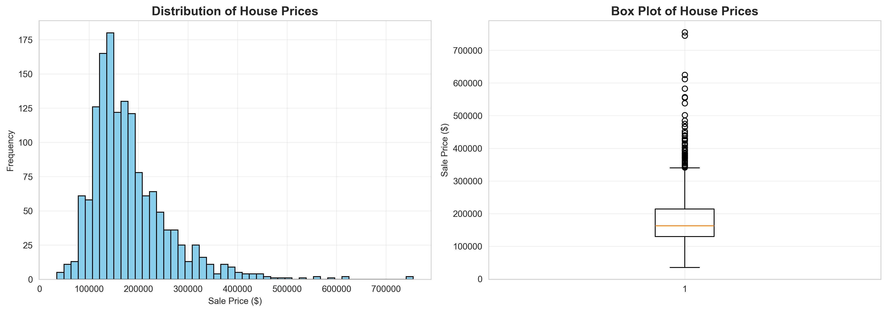
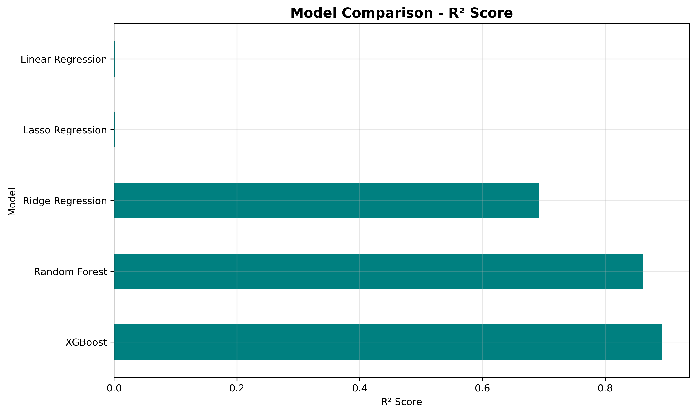
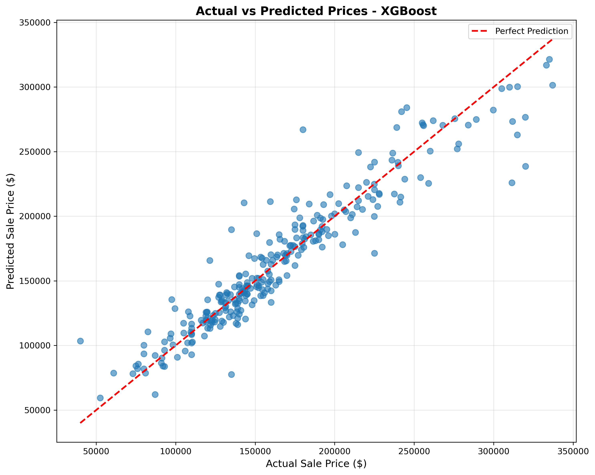

# House Price Prediction Using Regression Algorithms

A comprehensive machine learning project to predict house prices using various regression algorithms including Linear Regression, Ridge, Lasso, Random Forest, and XGBoost.

## 📋 Project Overview

This project analyzes the Ames Housing dataset and builds predictive models to estimate house sale prices based on 79 different features including square footage, number of bedrooms, location, year built, and various amenities.

## Visualizations

### Price Distribution

### Model Comparison

### Prediction Results

